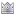
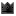

# Community Website Overview
The "community website" is principiagame.com, where all levels are published, discussed and played. This page provides an introduction to the various concepts on the community website.

## Building Contests
Building contests challenge you to build something specific. At least one contest is hosted per week, any player is free to participate in building contests.

## Trophies
A trophy is displayed beside your username and is awarded to you if you win a Building Contest. There are three kinds of trophies.
*  Silver Trophy - 1 achievement point
*  Golden Trophy - 5 Achievement Points
*  Black Diamond Trophy - 12 Achievement Points

## Achievement Points
Achievement points are awarded to you if you win a building contest or any of your levels is featured.

## Featured Levels
Featured levels are levels that have been hand-picked by the Bithack team. There are several feature categories, but the most significant one is the front page feature. A level featured to the front page reaches out to the whole active principia community and gathers much attention to the level.

Getting your level featured, whether to the front page or to a specific feature category, will award you with Achievement Points.

To get your level featured, simply create an amazing level and the Bithack team will find it.

## Videos
The video section allows you to send in Principia videos and show them to the community. First you need to upload your video to YouTube, and then you can add it to the Principia video section.

To learn how to record a video of Principia, visit [this page](Video_Recording).