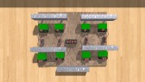
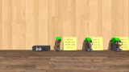
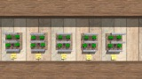

# Example Levels
See the beginner [Tutorials](Tutorials) for more example levels. Each tutorial has an included example level!

## Floor, ceil, square, square root

## Logic Gates

## Min, Max, Sum, Mul, Avg
