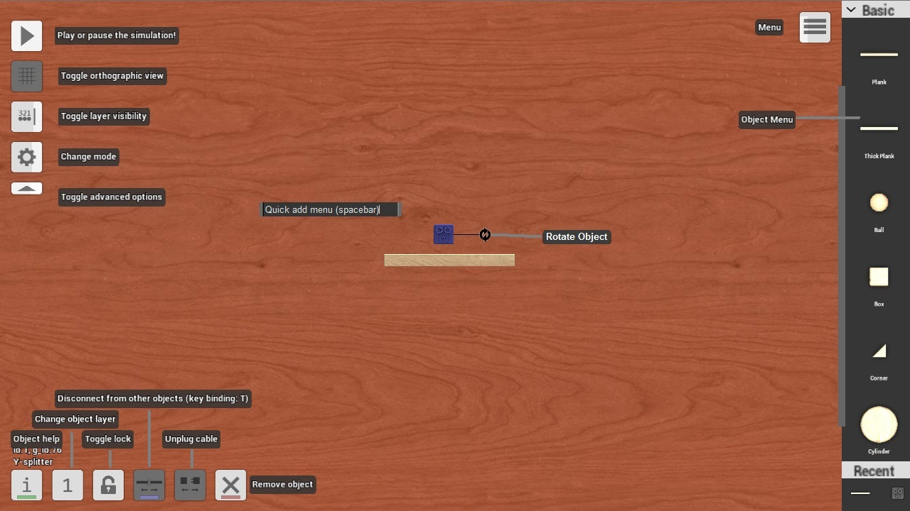

*todo: cleanup this mess*

## Building Modes

### Default Mode
While in the default building mode the view will be in 3D and objects can be placed or moved aywhere at any angle. This will often lead to messy looking angles, while rotating an object with touch controls hold down a second finger and you will able to lock the object to a particular angle and use Gridlock Mode(see below). The other building modes will provide many options for you to play with.

### Orthographic Mode
This mode switches the view while building to 2D and more importantly it switches to Orthographic (straight line) Mode also called Gridlock Mode, this will snap the single object you are moving to exact places on a world grid, marked in the width of a small box, 0.5 world size.

### Angle Lock
Gridlock Mode also provides the abilty to rotate objects and lock them to one of the 16 primary directions, North, North North-east, Northeast, East North-east East etc.

### The Builders Helper
If you are attempting to rotate or accidentally rotate more than one object at a time, the group will drag and lose its place and exact angles. For this reason you should build, move and rotate object groups attached to a temporary **Platform**. Platforms alone can maintain their perfect angles while rotated with a grouping of parts, any object group which is attached to a **Platform** when the platform is moved or rotated will be able to maintain is shape and match the angle change without warping the construction. An added bonus is that it allows you to move that object or group *through* other objects! This is the secret of integrated objects and making objects with no gaps. It is however forcing the objects together and can lead to glitchs if you are not lucky, make multiple saves if you attempt this trick.

## Layer Visibility Mode

### Invisible Layers
This mode allows you to look through the top layers of objects to see and move the parts underneath. Tap/click the button once to make the third layer invisible, tap/click again to make the second layer invisible and tap/click a third time to return to normal view.

You will then be able to change settings and make changes to the hidden objects without accidentally grabing an upper layer part.

## Connection Edit Mode
By activating connection edit mode you will bring up a circular icon representing every nail and pivot in your creation. Each connection can be selected and it's strength can be increased or decreased. If you plan on weakening connections, it is reccomended to do it before the build is extremly cramped, it can be difficult to find the connection you are looking for in a group with many nails and pivots.
### Destroy Connections Feature
By decreasing the strength of a connection you can create groups of objects which can be destroyed by force or by using the "Destroy Connections" setting on an **FX Emitter**. Connect the emitter to the grouping with weakened connections, when the emitter is activated the entire group will shake and weaker connections will snap and crumble.

## Multiselect Mode
### Saving Objects For Export
Multiselect Mode is used to create copies of entire groups of objects and will save you more time than any other feature. When saved, all objects in the group will maintain their settings, layer positions, positions relative to each other and rotational orientation. Objects affixed to the background like **Platform**s cannot be saved.

First decide which group of objects you want to copy, we'll use a ten minute **Digital display** timer as an example. Set all connections and object settings and orient the object in the same way as you would want it to load in as. Make sure any extra wires and nails leading to other things are removed temporarily.

Activate Multiselect mode, a white dot will appear on screen. Now tap the object group(timer) you wish to export, it should highlight and a new symbol will appear in the bottom left corner with a "down" load arrow(note: The two-part objects **Damper**s, **Rubberband**s and **Open Pivot**s are currently not exporting well, we suggest you remove them and reattach after importing)

Tap the new Download icon and it will bring up a save prompt, name the object so you understand what it is, you will have a big list eventually. We name it "10mintimer". The object is now saved and can be imported and emitted from a **Multi-emitter**

### Importing Saved Objects
Activate Multiselect mode, a white dot will appear on screen. Tap the location you wish your imported object group to appear, the white dot should move to that position and a new icon will appear in the bottom left corner with an "up" load arrow. Tap the Upload icon and it will bring up a list of all objects you have previously saved. Select the item you want and it will load in at the position desired... if there is not enough room it will load in all mixed up with any other parts which are in it's way, be careful. Currently there is no undo feature, be sure to save before loading, if you load in the wrong 1000 part object, you will need to delete each part individually.

Like the list of levels, you can hold down on one of the choices on the list to delete it from the list of saved objects. **LuaScript** boxes and customized **Digital display**s are the only thing you will be likely save by themselves.

### Using the Multi-emitter
The **Multi-emitter** requires you to save objects to the list before they can be chosen as an emittable object. The **Multi-emitter** size will increase depending on how large the selected imported object is. Like the normal **Emitter** no part of the **Multi-emitter** may be blocked or nothing will appear.

# Building Tools
## Rotate Object
When an object is selected it's rotate pad icon will appear, grab ahold and drag it in a circle to rotate the object in place. The further you move your mouse or finger from center the slower it will rotate. Rotating groups of objects can become messy very quickly and they will rarely cooperate(see: The Builders Helper section above)

## Object Info Button
Tap this icon when you have an object selected and the object description for that particular part will pop up in a prompt. Check this wiki page or search principiagame.com for the object type to find more information about a component and what it's capable of.

## Change Layer Button
All but a few parts in the game can be set on one of three different layers, when you have an object selected tapping this icon will change its layer orientation. Switching from layer three back to one will break some wiring connections as the two ends of any wire cannot be connected to objects two layers apart.

## Remove Connections Button
If this button is pressed while an object is selected all nail connection and multilayered pivot connections for that object will be undone.

## Remove Cable Plugs Button
This button will bring up small circles associated with each wire, **Jumper**, **Receiver**, or **Mini transmitter** that is connected to the object, tap one of the circle to seperate the connection it is associated with.

## Toggle Puzzle Interaction Button
While building in Puzzle Mode objects will have an additional hand icon. If the icon is selected for a particular object the player will be able to manipulate that object during Puzzle gameplay.

## Remove Object Button
This will quite simply delete the object that is highlighted. Take care not to erase things accidentally.

# Pull-out Parts Menu
Hold the long bar on the edge of the parts menu to pull out and widen the menu. Tap the long bar to snap close the menu or drag it back closed. By highlighting an object already on the board and dragging out a new part of the same type, the new object will have identical settings, level orientation, size and rotation as the selected object.

## Select Category
By tapping the top of the parts menu a list of categories will appear, select the desired category and the parts on the pull out menu will change.

## Recently Used
The bottom of the parts menu will show the last few items you have added to the board for easy access to more of that type.

## Quickadd Button
The quickadd icon will bring up a prompt allowing you to type in a few letters to find an object. You can then add that type of part to the center of the board.

The hotkey for quickadd on PC is the space button.

## Default Layer
By highlighting nothing (tap/clicking the background) the icon in the bottom left will allow you to change the default layer of all new objects you bring into play.